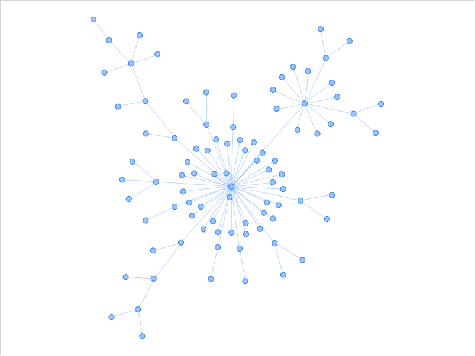

# COVID-19 "Lineage Tracing" Analysis

Some basic COVID-19 analysis using FAMSA (https://github.com/refresh-bio/FAMSA), SNP-sites (https://github.com/sanger-pathogens/snp-sites), and Cassiopeia (https://github.com/YosefLab/Cassiopeia). The idea is that the recently developed single-cell lineage tracing algorithms might be useful to track phylogenetic history of the COVID-19 virus strains. Here I tried using Cassiopeia as a proof of concept.

**Click here to see a network visualization using Vis.js: https://raw.githack.com/pjb7687/covid19-analysis/master/network-visjs.html**

The analysis was done as following (also have a look [covid19.ipynb](./covid19.ipynb)):

1. COVID-19 sequences were downloaded from GISAID (from human, only full sequences)
2. Multiple sequence alignment was done by FAMSA
3. The alignment result was converted to VCF using SNP-sites (only cared about SNVs)
4. The strains with the exactly same variations were deduplicated.
5. The lineage network was constructed using Cassiopeia - unlike the phylogenetic tree, one node can have multiple children.
6. The network was visualized using NetworkX and Matplotlib (and ForceAtlas2 for a prettier embedding).
7. The network was exported to JSON and visualized using Vis.js.
